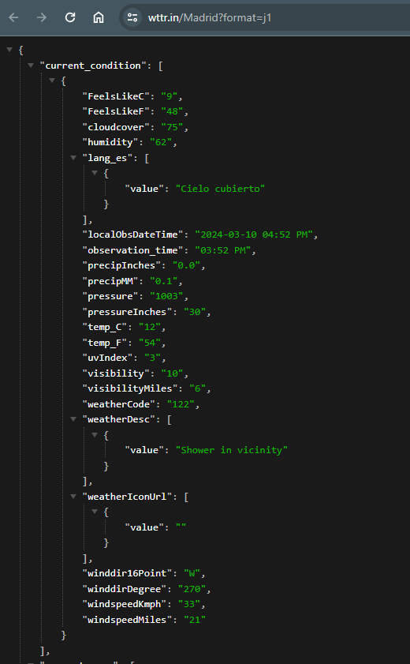

# Weather App

En este ejemplo creamos una app con React (utilizando Vite) para mostrar el tiempo de una ciudad en concreto. 

Para ello hacemos uso de la API [wttr.in](https://wttr.in/). El formato de las llamadas a la API para una ciudad específica es:
`https://wttr.in/Madrid?format=j1`



Podemos sustituir 'Madrid' por la ciudad que queramos sustituyendo la url en el archivo App.jsx


## Instalación
- Instalar dependencias NodeJS. Desde la terminal ve al directorio de 'weather-app'
```sh
npm install
```

- Una vez instaladas las dependencias podremos arrancar el servidor de desarrollo
```sh
npm run dev
```
